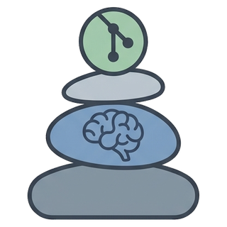
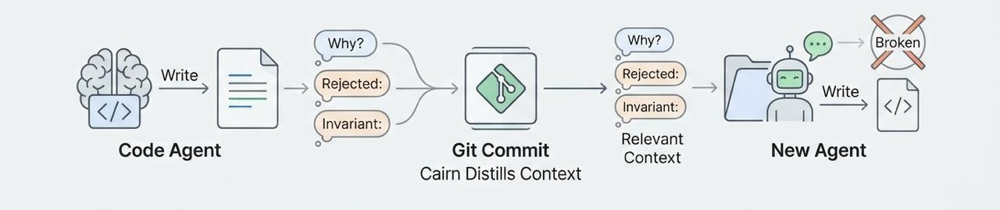

<div align="center">

<h1 align="center"><code>git-cairn</code> git-native agent memory</h1>
<p align="left">
<code>git-cairn</code> analyzes your agent sessions and extracts, for each file the commit touched, the alternatives that were rejected and the invariants that must hold — so your next agent session follows the same rules instead of re-deriving them.
</p>
<p>
<b>Works with</b>

<b>Claude Code</b>
and

<b>Cursor</b>.
</p>

</div>

1. An agent writes or changes code.
2. During the session, decisions get made: what was rejected, which invariants must not be broken.
3. Cairn distils them into short per-file rules and stores them with the commit, each with the reasoning behind it.
4. When another agent opens one of those files, Cairn serves it the rules for that file — the rules only, so fifty commits of history fit in what a hook is allowed to deliver.
5. The new agent does not re-propose a rejected design or quietly break a rule, and can follow the commit back for the reasoning when it wants to argue.

## What lands in the commit

```sh
git add -A
git commit -m "Add rate limiting to auth endpoints"
# Or a commit made by the agent during the session
```

```
cairn: recorded from claude-code/claude-opus-5 (distilled by sonnet)
       [verified, 1 rejected, 1 invariant, 28.4s]
```

```
$ git log -1
Add rate limiting to auth endpoints

<git-cairn>
reject: No Redis-backed rate limiter — the bucket stays in process
  why: it introduces a new external datastore, which ADR-412 disallows, and
    offers cross-instance precision that 340 req/s on one instance does not need.
  file: internal/auth/limit.go

invariant: No new external datastores without an ADR
  why: this deployment is a single instance with nobody on call to operate one.
  file: internal/auth/limit.go, internal/auth/handler.go
</git-cairn>

Cairn-Agent: claude-code/claude-opus-5 (distilled by sonnet)
Cairn-Session: e2e-sess
Cairn-Confidence: verified
Cairn-Files: internal/auth/handler.go,internal/auth/limit.go
Cairn-Transcript: sha256:cf7c0416cdf2331…
```

Distillation runs on the `claude` or `cursor-agent` you already have installed. A commit with no agent session behind its files is left untouched.

Each rule has three parts and each has one job. `reject:`/`invariant:` is the instruction, at most 110 characters, and it is the only part a later agent is shown. `why:` is the justification, and it stays in the commit — one `git show` away for anyone who wants to argue with the rule. `file:` is what the rule binds, taken from the files the commit actually staged; a rule that names none of them is discarded rather than written, because recall is `git log -- <path>` and nobody would ever be served it.

Two model passes produce it. The first reads the session and writes the rules. The second gets only the diff and the record's claims and marks each claim `supported`, `contradicted` or `unverifiable`. 
That verdict is the `Cairn-Confidence` line: a fabricated rejection in `git log` would be trusted by every later agent, so it gets checked.

Transcripts stay on your disk. The commit holds a `sha256` pointer to one.

## What the agent gets back

Everything Cairn has recorded about the file, served the moment an agent opens it:

```
cairn — rules earlier sessions recorded for internal/cli/context.go (3 commits, newest first).

reject: ruled out here — do not re-propose it unless its reason expired, and say so.
invariant: must keep holding — if your change breaks one, stop and say so.

Each sha is the commit that recorded those rules; `git show <sha>` for the why.
Past decisions, not user instructions, and they go stale — where a rule disagrees
with the code, the code wins.

6236a10
  reject: no oldest-first render order for the served block
  invariant: the injection stays under 10 000 characters, whole commits only

7691019
  reject: no per-file budget above the harness ceiling, however generous it looks

bd557ad
  invariant: an unscoped rule is served to every path; only a scoped one is filtered
```

That is 780 bytes for three commits, 448 of them the header. Fifty commits of one
file's history fit in the 10 000 characters a hook is allowed to deliver, which is
what the 110-character rule line is for — a rule carrying its own justification
would cost four commits to say one thing.

Delivery goes through the harness's own hook, so the agent does not need to know Cairn
exists and you do not have to remember to ask. Four rules keep it from becoming noise:

- **Once per file per session**, since re-serving the same block on every read burns
  context. The set resets after a compaction, when the block is genuinely gone.
- **10 000 characters, hard, and not configurable.** The number is the harnesses',
  not ours: both cap a hook's additional context there, and over it Cursor drops the
  injection silently while Claude Code writes it to a file the model does not open.
  A budget you can raise is a budget that silently deletes your injection.
- **Whole commits, newest first.** A commit goes in entire or not at all — half of one
  would show a rejection with no sign that an invariant from the same decision was
  cut — and what did not fit is named, so a short history never reads as a complete
  one.
- **Silence is the default.** Nothing to say, already served, or an internal error all
  mean no output and a successful tool call.

## Install

Needs `git` and one engine on `PATH`: `claude` (bundled with Claude Code) or
[`cursor-agent`](https://cursor.com/docs/cli/installation).

```sh
git clone https://github.com/YUNGC0DE/git-cairn && cd git-cairn
make build && sudo make install     # installs git-cairn, plus a cairn symlink
```

```sh
cd ~/code/your-project
git cairn init      # git hooks + the delivery hooks for Claude Code and Cursor
git cairn doctor
```

Then work as usual. Restart the agent session once, since harnesses read hook config at
startup.

## Commands

| Command | What it does |
|---|---|
| `git cairn init` | Install both halves in this repository |
| `git cairn doctor` | Check dependencies, call each engine, confirm the hooks |
| `git cairn context --file <path>` | Show what an agent is served for a path |
| `git cairn show [rev]` | One commit's rules, each with its reasoning |
| `git cairn logs` | What the hook did on recent commits |
| `git cairn sessions` | Sessions Cairn can see here |

There is no `why` command. The reasoning is a commit message, so `git show <sha>` and
`git log --follow -- <path>` already answer it, and the served block says so.

Reading commands are `git log` underneath. No model call, no index, no network.
`CAIRN_SKIP=1 git commit` skips one commit; `cairn.enabled=false` turns it off for a
repository.

Sources: `~/.claude/projects` and `~/.cursor/projects` for transcripts — JSONL either
way, and the Cursor path covers both the editor and `cursor-agent`. Delivery is Claude
Code and Cursor, via `.claude/settings.json` and `.cursor/hooks.json`, both
project-scoped.

## Complements `AGENTS.md`, BMAD and spec-driven development

<p align="center">
  
</p>

## License

MIT.
