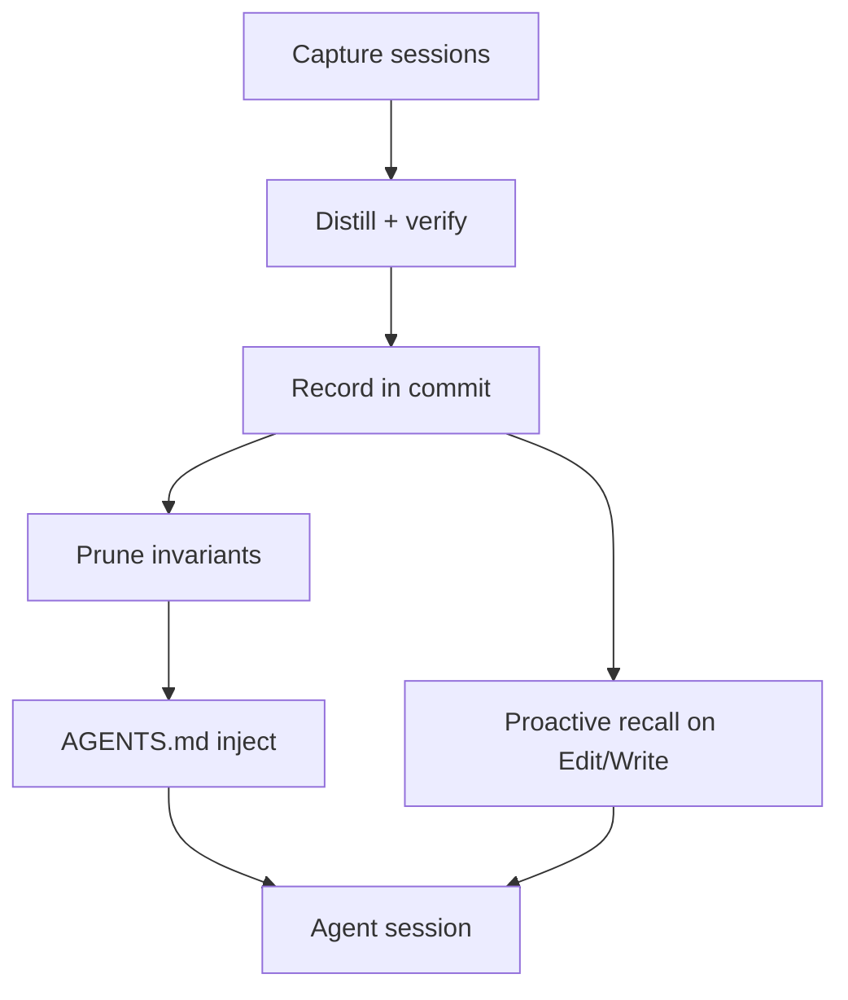

# Git Cairn

Git Cairn adapts git for multi-harness agent coding. Claude Code, Cursor CLI, and Cursor IDE share one repo. On commit, Cairn records what was decided, what was turned down, and what became a rule, then checks claims against the diff. That record feeds two equal channels of guidance:

1. **At edit time** — before the agent changes a file, Cairn hands it the history and logic for that path (prior decisions, rejections, scoped rules). The agent does not have to ask. This is the fix for dirty vibe coding: same bad idea, second try, because the session forgot the first no.
2. **At session start** — pruned project rules land in `AGENTS.md` / `CLAUDE.md` between markers, under a hard token budget, so every harness sees the same standing guidance.

## Why it exists

Vibe coding fails when the agent invents a justification, retries a rejected design, or drifts past a rule that used to live in someone's head. Cairn closes that loop:

| Knowledge | Stored in | Delivered by |
|---|---|---|
| What you decided for this change | the commit | proactive recall on that file's path |
| What you rejected | the commit | same; `cairn rejected` when you ask |
| Standing project rules | `.cairn/invariants.md` → `AGENTS.md` | session start + scoped inject on edit |

`AGENTS.md` alone goes stale and contradicts itself. Path-level recall alone has no shared budgeted rule set. Together they stop the agent from doing the wrong thing twice, and they keep humans from re-explaining the same ADR in every PR.

## How it works



| Stage | What happens |
|---|---|
| **Capture** | One git hook. Read new transcript tails for this repo (Claude Code, Cursor CLI, Cursor IDE). No agent-side hooks. |
| **Distill** | Per session: intent, decision, `Rejected`, invariant candidates, open items, next step. Second pass verifies claims against the diff only (never the chat). Write 1–3 KB into the commit or a git note. |
| **Prune** | Score invariants by confirmation and recency, hard token budget, archive overflow, flag contradictions for a human. The hard part is removing stale rules. |
| **Recall** | Two peers: (1) on the first read or edit of path X in a session, push that path's records into the agent before it decides — this half is built, through the harness's own hooks; (2) inject budgeted rules into `AGENTS.md`. Also `cairn why` / `rejected` when a human asks. |

Transcript bodies stay on your disk. Git stores a checksum pointer. Distillation rides your existing `claude` or `cursor-agent` subscription.

## Install

Needs `git`, plus `claude` or `cursor-agent` on `PATH`. `sqlite3` for Cursor sessions.

```sh
git clone https://github.com/YUNGC0DE/Cairn && cd Cairn
make build && sudo cp bin/cairn /usr/local/bin/
cairn version
```

## First repo

```sh
cd ~/code/your-project
cairn init
cairn doctor
```

Work with an agent as usual. The usual path is the agent running `git commit` itself. You can also commit by hand after the agent finished — same hook, same record. Whoever types the command, if an agent session touched the staged files, the session logic lands in `git log`.

```sh
git add -A
git commit -m "Add rate limiting to auth endpoints"
```

```
cairn: recorded from claude-code/claude-opus-5 (distilled by sonnet)
       [verified, 1 rejected, 1 invariant, 28.4s]
```

```
$ git log -1
Add rate limiting to auth endpoints

Credential stuffing hit /login with 40k attempts overnight per nginx logs;
rate limiting was added to stop repeated attempts from a single client.

Chose an in-memory per-key token bucket over a Redis-backed sliding window:
ADR-412 prohibits new external datastores without an ADR, and at 340 req/s on
a single instance cross-instance precision isn't needed.

Rejected: Redis-backed sliding window rate limiter — would introduce a new
external datastore, which ADR-412 disallows, and offers precision the
single-instance workload doesn't need

Invariant: No new external datastores without an ADR (internal/auth/**)

Open: Only the /login handler has rate limiting applied; other auth endpoints
are not yet covered.
Next: Apply the same rate limiter to the remaining auth endpoints.

Cairn-Agent: claude-code/claude-opus-5 (distilled by sonnet)
Cairn-Session: e2e-sess
Cairn-Confidence: verified
Cairn-Files: internal/auth/handler.go,internal/auth/limit.go
Cairn-Transcript: sha256:cf7c0416cdf2331…
```

A commit with no agent transcript for those files (pure human edit) stays untouched.

## Read it back

```sh
cairn why internal/auth/limit.go   # why this file looks like this
cairn rejected redis               # options already turned down
cairn show HEAD
cairn logs                         # what the hook did on recent commits
cairn audit -n 20                  # replay history against local transcripts
```

`why` / `rejected` / `show` are `git log` underneath. No model call.

## Commands

| Command | Purpose |
|---|---|
| `cairn init` | Install hooks |
| `cairn doctor` | Probe engines, transcripts, hooks |
| `cairn why <path>` | Decision history for a path |
| `cairn rejected <q>` | Search rejected alternatives |
| `cairn show [rev]` | Print one record |
| `cairn logs` | Hook run log |
| `cairn audit` | Offline corpus / confabulation check |
| `cairn sessions` | List discovered sessions |
| `cairn resume` | Branch brief for a fresh agent *(planned)* |
| `cairn park` | WIP snapshot between commits *(planned)* |
| `cairn prune` | Score and retire stale invariants *(planned)* |

`CAIRN_SKIP=1 git commit …` skips one commit. `CAIRN_DEBUG=1` prints the hook path.

## Harnesses

| Source | Role |
|---|---|
| Claude Code | Transcripts |
| Cursor CLI | Transcripts |
| Cursor IDE | Transcripts |
| `claude` / `cursor-agent` | Distillation engines |

## Status

| Capability | State |
|---|---|
| Capture Claude Code + Cursor CLI + Cursor IDE | Done |
| Distil + verify on commit (multi-session) | Done |
| Pull commands (`why` / `rejected` / `show` / `logs` / `audit`) | Done |
| **Recall at edit time** (path history pushed before the agent edits) | Done |
| `message` / `notes` modes | Done |
| Invariants + prune + **`AGENTS.md` inject** | Todo |
| Eval harness (with / without Cairn) | Todo — design in [ROADMAP](ROADMAP.md#the-benchmark) |
| Measured confabulation rate | Todo — needs a corpus |
| `resume` / `park` | Deferred |
